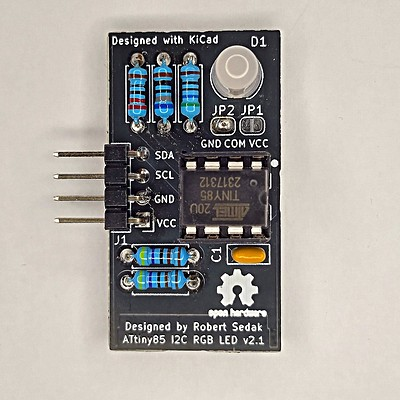
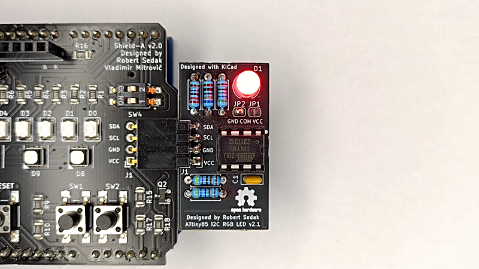

[Engleska verzija](README.md).

Uvod
============
Svrha edukacijskog modula ATtiny85 I2C RGB LED je edukacija učenika. Prikazuje kako upravljati s RGB LED  pomoću I2C protokola.

Autor
------------
- Robert Sedak — svojstva, programiranje, dizajn el. scheme, CAD dizajn.

Application
-----------
Robert Sedak je snimio video s primjerom programiranim u Arduino IDE s podrškom za ATtiny85:

Primjere za Arduino IDE možete preuzati [ovdje](examples/).

Popis komponenti
-----------------
- 1 kom, PCB
- 1 kom, 220 ohm 1/4W 1% otpornik (R1)
- 1 kom, 560 ohm 1/4W 1% otpornik (R1)
- 1 kom, 680 ohm 1/4W 1% otpornik (R1)
- 2 kom, 4.7K ohm 1/4W 1% otpornik (R4, R5)
- 1 kom, RGB LED 5mm Kingbright WP154A4SUREQBFZGW (D1)
- 1 kom, 100nF 50V keramički kondenzator
- 1 kom, 8-Pin DIL IC podnožje
- 1 kom, ATtiny85
- 1 kom, 1x4 pin 2.54mm Pin Header - desni kut (J1)

Datoteke s dizajnom
------------
Ovaj semafor je dizajniran pomoću programa [KiCad](http://kicad.org/). Datoteke se nalaze u mapi [design_files](design_files/). Elekroničku schemu možete pogledati [ovdje](images/attiny85_I2C_RGB_LED_v21_schematic.png).

Gerber datoteke
------------
Gerber datoteke možete preuzeti [ovdje](gerber/attiny85_I2C_RGB_LED_v21.zip).

Firmware
--------
Ovo učilo može biti progrmairano pomoću [Arduino IDE](https://www.arduino.cc/).
[ATTinyCore by Spence Konde](https://github.com/SpenceKonde/ATTinyCore) je korišten za programiranje ATtiny85 u Arduino IDE.
Primjer za Arduino IDE se nalazi u mapi [examples](examples/).

Licenca
-------
[Imenovanje-Dijeli pod istim uvjetima 4.0 međunarodna (CC BY-SA 4.0)](https://creativecommons.org/licenses/by-sa/4.0/deed.hr)

Slobodno možete:
- Dijelite dalje — možete umnažati i redistribuirati materijal u bilo kojem mediju ili formatu
-  Stvarajte prerade — možete remiksirati, mijenjati i prerađivati djelo u bilo koju svrhu, pa i komercijalnu

Davatelj licence ne može opozvati slobode korištenja koje Vam je ponudio dokle god se pridržavate uvjeta licence.

Pod sljedećim uvjetima:
- Imenovanje — Morate adekvatno navesti autora, uvrstiti link na licencu i naznačiti eventualne izmjene. Možete to učiniti na bilo koji razuman način, ali ne smijete sugerirati da davatelj licence izravno podupire Vas ili Vaše korištenje djela.
- Dijeli pod istim uvjetima — Ako remiksirate, mijenjate ili prerađujete materijal, Vaše prerade morate distribuirati pod istom licencom pod kojom je bio izvornik.

Bez daljnjih ograničenja — Ne smijete dodavati pravne uvjete ili tehnološke mjere zaštite koji će druge pravno ograničiti da čine ono što im licenca dopušta.

Odricanje od odgovornosti
-------------------------
NAPOMENA - Dizajn je objavljen u dobroj namjeri i "takav kakav je" ("AS IS"), te sa mogućim greškama. Autor je kreirao učilo, slike, video i programski kod. Autoru je radilo i uspjelo raditi na način kako je opisano, što ne znaći da će raditi i Vama. Ne odgovaram ni za kakve posljedice koje mogu nastati prilikom korištenja učila, uputa ili programskog koda. Odričem se sve odgovorosti i jamstva- sami ste odgovorni za ono što radite i sami ste odgovorni što ste pristali pratiti i koristiti naše upute i informacije.

Autor može mijenjati specifikacije i opise proizvoda u bilo kojem trenutku, bez prethodne obavijesti. Korisnik se ne smije osloniti na odsutnost ili karakteristike bilo kojih značajki ili uputa označenih kao "rezervirano" ili "nedefinirano".
Autor zadržava pravo budućih izmjena definicija i neće snositi nikakvu odgovornost za sukobe ili nekompatibilnosti koje proizlaze iz budućih promjena. Podaci o proizvodu na web stranici ili materijalima podložni su promjenama bez prethodne obavijesti. Nemojte finalizirati dizajn s ovim podacima.